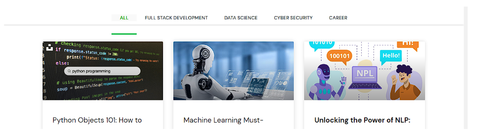

# React Router task

The objective of this task is to create a web page with routes using react-router-dom. The design of the page should be based on the following img

Refer to[ https://reactrouter.com/en/main](https://reactrouter.com/en/main) for any help or guidance on React Router DOM.

##### Requirements:

1. In The Above link you will find the navigation for courses in the middle of the page like All , full stack development, Data science , Cyber Security & Career As Navigation menu
2. Create that navigation to courses using react router dom and add the contents as static as given in pages
3. The navigation menu which needs to be created is screenshotted and placed below for your
4. Reference

#### Deployment Link :

* Netlify url :[https://reactroutercoures.netlify.app/](https://reactroutercoures.netlify.app/)
